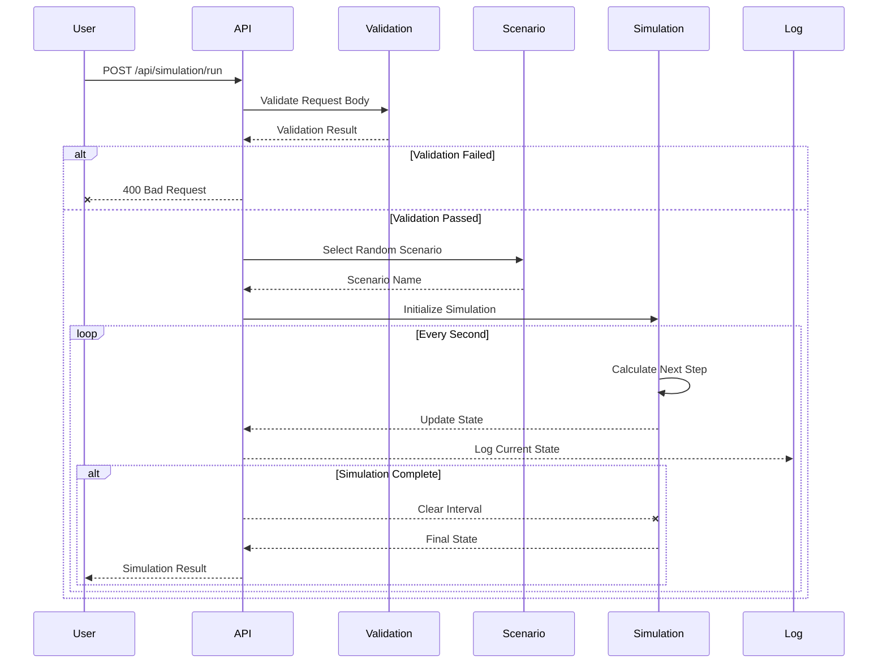

# Astrodex

Simulating the launch, flight, and landing of a rocket. It calculates various parameters in real-time, including fuel consumption, altitude, velocity, and payload status. The simulation can handle different mission scenarios, such as launching to various planets, experiencing engine failures, and more.

## How does it work?


## Installation
```
1. git clone https://github.com/Marcus-Johnson/Astrodex.git
2. npm i
3. npm start
4. Send your cURL via Postman!
```

## Brief cURL Explanation
```
{
  "rocket_specifications": {
    "weight": <number>,               // Weight of the rocket in kilograms
    "height": <number>,               // Height of the rocket in meters
    "diameter": <number>,             // Diameter of the rocket in meters
    "fuel_capacity": <number>,        // Fuel capacity of the rocket in liters
    "engine_thrust": <number>,        // Engine thrust in kN
    "fuel_efficiency": <number>,      // Fuel efficiency (specific impulse) in seconds
    "number_of_stages": <number>,     // Number of rocket stages
    "payload_capacity": <number>      // Payload capacity in kilograms
  },
  "mission_parameters": {
    "destination": <string>,          // Destination of the mission (e.g., Mars, Moon)
    "launch_site": {
      "latitude": <number>,           // Latitude of the launch site
      "longitude": <number>           // Longitude of the launch site
    },
    "launch_angle": <number>,         // Launch angle in degrees
    "launch_date": <string>           // Launch date and time in ISO format
  },
  "environmental_factors": {
    "atmospheric_conditions": {
      "pressure": <number>,           // Atmospheric pressure in Pascals
      "temperature": <number>         // Atmospheric temperature in Kelvin
    },
    "wind_speed": <number>,           // Wind speed at the launch site in m/s
    "gravity": <number>               // Gravitational acceleration at the launch site in m/s²
  },
  "payload_details": {
    "payload_weight": <number>,       // Weight of the payload in kilograms
    "payload_type": <string>,         // Type of the payload (e.g., satellite, rover)
    "payload_dimensions": {
      "length": <number>,             // Length of the payload in meters
      "width": <number>,              // Width of the payload in meters
      "height": <number>              // Height of the payload in meters
    }
  },
  "trajectory_information": {
    "initial_velocity": <number>,     // Initial velocity of the rocket in m/s
    "target_orbit_altitude": <number>,// Target orbit altitude in kilometers
    "transfer_orbit": {
      "apoapsis": <number>,           // Apoapsis of the transfer orbit in kilometers
      "periapsis": <number>           // Periapsis of the transfer orbit in kilometers
    },
    "flight_path_angle": <number>     // Flight path angle in degrees
  },
  "fuel_and_propulsion_details": {
    "fuel_type": <string>,            // Type of fuel (e.g., RP-1)
    "oxidizer_type": <string>,        // Type of oxidizer (e.g., Liquid Oxygen)
    "burn_time_per_stage": [<number>] // Array of burn times for each stage in seconds
  },
  "additional_parameters": {
    "communication_range": <number>,  // Maximum communication range in kilometers
    "navigation_system": <string>,    // Type of navigation system used
    "thermal_protection": <string>    // Type of thermal protection system
  }
}

```

## Blank cURL	
```
curl -X POST http://localhost:3000/api/simulation/run \
-H "Content-Type: application/json" \
-d '{
  "rocket_specifications": {
    "weight": 0,
    "height": 0,
    "diameter": 0,
    "fuel_capacity": 0,
    "engine_thrust": 0,
    "fuel_efficiency": 0,
    "number_of_stages": 0,
    "payload_capacity": 0
  },
  "mission_parameters": {
    "destination": "",
    "launch_site": {
      "latitude": 0,
      "longitude": 0
    },
    "launch_angle": 0,
    "launch_date": "YYYY-MM-DDTHH:MM:SSZ"
  },
  "environmental_factors": {
    "atmospheric_conditions": {
      "pressure": 0,
      "temperature": 0
    },
    "wind_speed": 0,
    "gravity": 0
  },
  "payload_details": {
    "payload_weight": 0,
    "payload_type": "",
    "payload_dimensions": {
      "length": 0,
      "width": 0,
      "height": 0
    }
  },
  "trajectory_information": {
    "initial_velocity": 0,
    "target_orbit_altitude": 0,
    "transfer_orbit": {
      "apoapsis": 0,
      "periapsis": 0
    },
    "flight_path_angle": 0
  },
  "fuel_and_propulsion_details": {
    "fuel_type": "",
    "oxidizer_type": "",
    "burn_time_per_stage": [0]
  },
  "additional_parameters": {
    "communication_range": 0,
    "navigation_system": "",
    "thermal_protection": ""
  }
}'

```

## Earth to Mars cURL
```
curl -X POST http://localhost:3000/api/simulation/run \
-H "Content-Type: application/json" \
-d '{
  "rocket_specifications": {
    "weight": 500000,
    "height": 70,
    "diameter": 7,
    "fuel_capacity": 300000,
    "engine_thrust": 7600,
    "fuel_efficiency": 300,
    "number_of_stages": 2,
    "payload_capacity": 20000
  },
  "mission_parameters": {
    "destination": "Mars",
    "launch_site": {
      "latitude": 28.5721,
      "longitude": -80.6480
    },
    "launch_angle": 90,
    "launch_date": "2024-12-01T14:00:00Z"
  },
  "environmental_factors": {
    "atmospheric_conditions": {
      "pressure": 101325,
      "temperature": 288.15
    },
    "wind_speed": 10,
    "gravity": 9.81
  },
  "payload_details": {
    "payload_weight": 10000,
    "payload_type": "satellite",
    "payload_dimensions": {
      "length": 3,
      "width": 3,
      "height": 3
    }
  },
  "trajectory_information": {
    "initial_velocity": 0,
    "target_orbit_altitude": 200,
    "transfer_orbit": {
      "apoapsis": 35786,
      "periapsis": 200
    },
    "flight_path_angle": 45
  },
  "fuel_and_propulsion_details": {
    "fuel_type": "RP-1",
    "oxidizer_type": "Liquid Oxygen",
    "burn_time_per_stage": [180, 360]
  },
  "additional_parameters": {
    "communication_range": 500000,
    "navigation_system": "GPS",
    "thermal_protection": "Ablative Heat Shield"
  }
}'
```